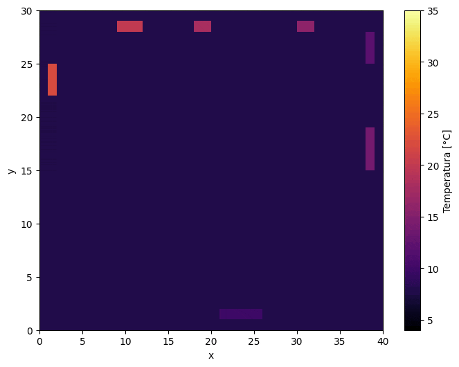

# Heat-propagation 

## Opis projektu  
Projekt **Heat-propagation** to symulacja rozchodzenia się ciepła w mieszkaniu przy założeniu spełniania równania dyfuzji wykorzystująca bibliotekę **NumPy** oraz **Matplotlib**.  Kod pozwala na wizualizację oraz analizę ilościową i jakościową rozkładu temperatur w różnych warunkach. 

## Struktura projektu  
- **`Równanie ciepła.pdf`** – Raport zawierający opis poruszanych problemów
- **`run_experiments.py`** – Główny plik uruchamiający symulację  
- **`run_animations.py`** – Plik uruchamiający animacje
- **`project.py`** – Plik ze zdefiniowanymi wszystkimi klasami i funkcjami pomocniczymi
- **`physical_and_numerical_data.json`** – Plik zawierający stałe fizyczne wykorzystywane w obliczeniach 
- **`data.csv`** – Plik csv zawierający temperatury dobowe w trzech wariantach 
- **`requirements.txt`** – Lista wymaganych bibliotek  
- **`images`** - Folder z wybranymi wizualizacjami z symulacji


## Wymagania  
Projekt wymaga bibliotek:  
- `numpy`  
- `matplotlib`   
  
Można je zainstalować za pomocą:  
```bash
pip install -r requirements.txt
```

## Animacje
Animacje ilustrujące rozchodzenie się ciepła w czasie zostały zaimplementowane w projekcie, jednak nie znalazły się w pliku pdf. W celu zobaczenia animacji należy uruchomić plik **`run_animations.py`** i wpisać pożądane parametry (dokładny opis w pliku).




*Ogrzewanie mieszkania*